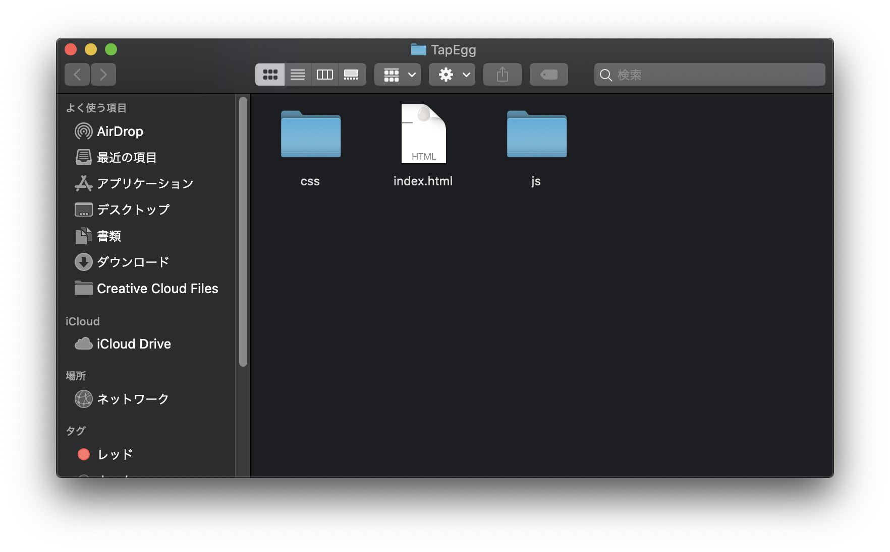
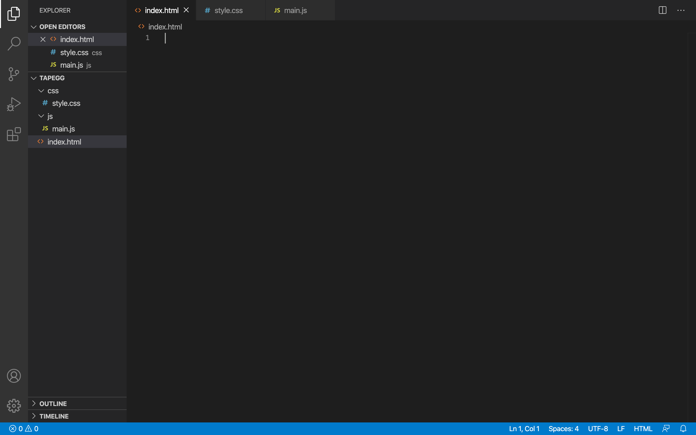
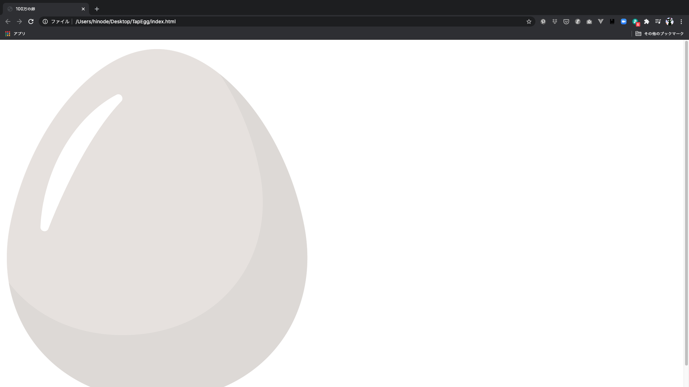

# 100万の卵を作ってみよう１
***

## 新規プロジェクトの作成
<br />


では早速新規プロジェクトを作成しましょう。

<br />
<br />
 

任意の場所に新規フォルダを作成し、その中にindex.htmlファイルを作成してください。また、「css」と「js」というフォルダを作成し、その中に「style.css」と「main.js」というファイルを作成してください。
<br />
<br />

作成方法がわからない場合は[こちら](https://websample-itnav.gitbook.io/websample/#fairuno)を参考にしてみましょう。

<br>



このようにVSCodeで３つのファイルを開いておきましょう。
***

## index.htmlの記述

<br>
<br>

では早速index.htmlファイルにコードを書いていきたいと思います。
まずは下記のように記述してください。

<br>

```html
<!DOCTYPE html>
<html lang="ja">
    <head>
        <meta charset="utf-8">
        <title>100万の卵</title>
        <link rel="stylesheet" href="css/style.css">
    </head>
    <body>

        <script src="js/main.js"></script>
    </body>
</html>
```


このコードの意味については[こちら](https://web-beginner-hinode.gitbook.io/project/htmlwoitemiyou)を参考にしてください。

<br>
<br>

こちらを保存し、GoogleChromeでindex.htmlファイルを開くと下の画像のように真っ白な画面が出てくるかと思います。


ならなかった場合は、もう一度コードをよく見て誤字・脱字がないか、または保存し忘れていないかなどを確認してください。

<br>
<br>
<br>
***

## 素材のダウンロード

<br />
<br />

次に、今回のアプリケーションで使用する素材をダウンロードしたいと思います。
素材は何を使っても構わないのですが、今回は
<a href="img/materials.zip" target="_blank">こちら</a>からダウンロードして使用してください。

<br>

そうすると、そのフォルダ内に「img」と「sound」というフォルダが入っているので、その２つを現在のプロジェクトのフォルダ内に移動させてください。

<br>

これで素材を使用する準備が整いました。


***

## 画像を表示する

<br>
<br>

次に先ほど入れた画像をブラウザに表示したいと思います。
index.htmlを以下のように変更してください。

```html
<!DOCTYPE html>
<html lang="ja">
    <head>
        <meta charset="utf-8">
        <title>100万の卵</title>
        <link rel="stylesheet" href="css/style.css">
    </head>
    <body>
        <p id="count"></p>
        <div class="img-box">
            
        </div>
        <script src="js/main.js"></script>
    </body>
</html>
```

bodyタグの中に4行ほど追記しました。

1行目のpタグはカウント数を表示するためのものですが、カウント数は後ほどJavaScriptから操作するのでhtmlでは空欄にしています。

divタグは単体では意味を持たないタグですが、各コンテンツをひとまとめにしたり、ブロックレベル要素としてグループ化することができるタグです。

imgタグは画像を表示するためのタグになります。

各タグについているidやclassは後ほどJavaScriptやCSSで要素を指定するときに使います。

<br>

ここまで書けたら保存して先ほど開いたブラウザを更新してみましょう。

<br>



<br>

このようにブラウザに卵の画像が表示されていれば成功です。