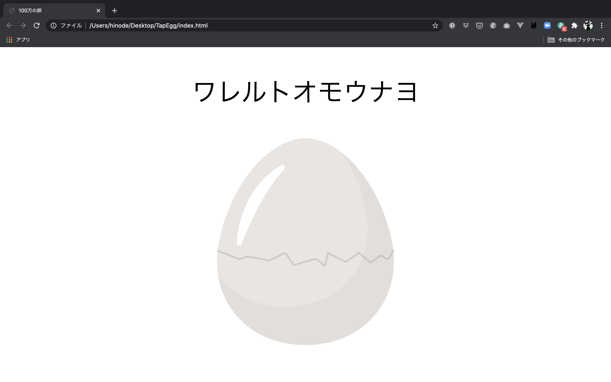

# 100万の卵を作ってみよう３

## スクリプトの記述


### Hello World!

まずはきちんとindex.htmlでmain.jsファイルを読み込めているか確認してみましょう。

<br />

main.jsファイルに以下のコードを記述してください。

```js
alert("Hello World!");
```

<br>

こちらを保存してブラウザをリロードすると


このようにアラートが表示されます。

表示されない場合は、きちんとindex.htmlファイルでmain.jsファイルを読み込んでいるか、フォルダ内にきちんとファイルが保存されているかなどを確認してください。


<br />
<br />

*** 

## カウント数の表示

次にJS側からカウント数を描画したいと思います。

main.jsファイルの中を下記のように変更してください。

alertは消しちゃって大丈夫です。

```js
let count = 10;
let countText = document.getElementById('count');

countText.textContent = count;
```

<br>

これで保存してブラウザをリロードすると画像の上に10という数字が表示されました。


<br />

``let count = 10;``で「10という値をcountという変数に代入する」という意味になります。

そして、``let countText = document.getElementById('count');``で「id名がcountの要素をcountTextという変数に代入する」という意味になります。

今回の場合は、index.htmlで記述した``<p id="count"></p>``が入りました。

``countText.textContent = count;``は「countという変数の値をcountTextのテキストに代入する」という意味です。

letの意味はいったん置いておきます。変数宣言の時につけるものと思っていてください。

<br />

***

## クリックでカウントを減らす機能の実装

次にこの画像をクリックしたらカウント数を減らせるようにしたいと思います。

main.jsファイルを以下のように変更してください。

```js
const eggImg = document.getElementById('egg-img');
let count = 10;
let countText = document.getElementById('count');

countText.textContent = count;

eggImg.onclick = function() {
    count--;

    countText.textContent = count;
};
```

<br>

記述が終わったら保存してブラウザをリロードしてください。

画像をクリックするとどんどんカウント数が減っていれば成功です。


<br />

``const eggImg = document.getElementById('egg-img');``で「id名がegg-imgの要素をeggImgという変数に代入する」という意味になります。

`eggImg.onclick = function() { }`で「eggImgをクリックした時にfunction内コードを実行する」という意味になります。

`count--`「countから1を引く（count = count - 1）」

で、引いたカウント数を`countText.textContent = count;`でcountTextのテキストに再代入して描画しています。

これでクリックする度にカウント数が減っていくようになりました。

<br />

### var、let、constとは

JavaScriptの変数宣言ではvar、let、constを使用します。

その中で、letとconstは、ECMAScript2015から採用された新しい宣言方法になっています。

<br>

ECMAScript2015（エクマスクリプト）とは、JavaScriptの標準仕様です。国際団体で標準化され、Google Chrome や Internet Explorer 11以降等、現代のブラウザで広く採用されています。

<br>

letとconstにより、変数の値を意図せず上書きしたり、間違って同じ名前の変数を宣言してしまうようなバグを防止できるようになりました。

<br>

varは再宣言と再代入ができる元々の宣言

letは再代入はできるが再宣言ができない

constは再宣言と再代入ができない

と覚えておいてください。

他にもスコープの違いなど色々あるのですが、今回は割愛します。


<br>

***

## カウント数０で止める

さて、画像をクリックするとカウント数を減らすことができました。

しかし、現状ですとカウント数が0になってもクリックできてしまいます。

ですので今回は、カウント数が0になったらカウントの描画を止めて、画像を変更するようにしたいと思います。

main.jsファイルを以下のように変更してください。

```js
const eggImg = document.getElementById('egg-img');
let count = 10;
let countText = document.getElementById('count');

countText.textContent = count;

eggImg.onclick = function() {
    count--;

    if (count <= 0) {
        countText.textContent = 'ワレルトオモウナヨ';
        this.src = 'img/cracked-egg.png';
        return;
    }
    countText.textContent = count;
};
```

<br>

書き終わったら保存してブラウザをリロードしてください。

画像をクリックしていき、0になったら下の画像のように変更されていれば成功です。



<br />

`if (count <= 0) { }`「countが0以下だった場合{ }内を実行」

`countText.textContent = 'ワレルトオモウナヨ';`「ワレルトオモウナヨというテキストをcountTextのテキストに代入」

`this.src = 'img/cracked-egg.png';`「img/cracked-egg.pngというテキストをeggImgのsrcに代入」`.src=`でその要素のsrc属性（画像のパス等）を代入することができます。

`return;`「関数を抜ける」

<br />

正確にはカウントは止まっていないのですが、これでカウント数がマイナスになることがなくなりました。

これで基本的な100万の卵の実装は完了です。

<br>

## カウント数を保存する

動きはできたのですが、このままではブラウザをリロードするとカウント数が初期値（10）に戻ってしまいます。

今は10なので、戻ってもそんなに大したことないですが、1,000,000だと頑張って途中までやったのにリロードした瞬間に元に戻ったら発狂しちゃうかもしれません。

<br>

### localStorageを使ってみる

なので自分が何回クリックしたのかを保存する機能を実装したいと思います。

本当はサーバー等に保存するのが１番いいのですが、今回はお試しということで「localStorage」を使っていきます。

​<br />

## localStorageとは

LocalStorageとはWebStorageと呼ばれるものの一つで、javascriptを用いてクライアント側にデータを保存する仕組みです。

ユーザのローカル(ブラウザ)にデータを保存することができるので、半永久的にデータを保持することができます。データの読み込み・更新も比較的簡単に行うことができます。

<br>

このlocalStorageを使って自身のブラウザにデータを保存します。

ちなみに今回はこの方法を使いましたが、localStorageはユーザー側で簡単にデータを改変できるのでリリースする時などはお勧めしません！

<br>

main.jsを以下のように修正してください。

```js
const intialValue = 10;
const eggImg = document.getElementById('egg-img');
let count = localStorage.getItem('tapCount');
let countText = document.getElementById('count');

if (!localStorage.getItem('tapCount')) {
    count = intialValue;
}
countText.textContent = count;

eggImg.onclick = function() {
    count--;
    localStorage.setItem('tapCount', count);

    if (count <= 0) {
        countText.textContent = 'ワレルトオモウナヨ';
        this.src = 'img/cracked-egg.png';
        localStorage.removeItem('tapCount');
        return;
    }
    countText.textContent = count;
};
```

`const intialValue = 10;`初期値を代入しておく

`let count = localStorage.getItem('tapCount');`「tapCountというKey (名前)のValue（値）をローカルストレージから取ってきてcountという変数に代入する」

`if (!localStorage.getItem('tapCount')) { }`「tapCountというKeyがなかった場合（まだ保存されていない場合）、{ }内を実行する」

`localStorage.setItem('tapCount', count);`「tapCountというKeyでcountというValueをローカルストレージに保存する」

`localStorage.removeItem('tapCount');`「tapCountというKeyの値をローカルストレージから削除する」

<br>

ここまで書き終わったら保存してブラウザをリロードしてください。

カウント数を少し減らして、ブラウザをリロードしてください。きちんと前のクリック数からスタートできていれば成功です。

<br>

***

## 効果音をつけてみる

だいぶ形にはなったのですが、ちょっと寂しいのでクリックした時に効果音が鳴るようにしたいと思います。

効果音がある前提なので、まだダウンロードしていない方はダウンロードしてsoundフォルダーに入れてください。

<br>

まずは「index.html」ファイルを開き、下記のように変更してください。

bodyの閉じタグの前にaudioタグを追加しました。

```html
<!DOCTYPE html>
<html lang="ja">
    <head>
        <meta charset="utf-8">
        <title>100万の卵</title>
        <link rel="stylesheet" href="css/style.css">
    </head>
    <body>
        <p id="count"></p>
        <div class="img-box">
            
        </div>

        <audio id="tap-sound" preload="auto">
            <source src="sound/tap.mp3" type="audio/mp3">
        </audio>
        <script src="js/main.js"></script>
    </body>
</html>
```

<br />

`<audio>` 要素は、文書内に音声コンテンツを埋め込むために使用します。

この要素は、1つまたは複数の音源を含むことができ、音源は src 属性または`<source>` 要素を使用して表し、ブラウザーがもっとも適切な音源を選択します。

<br/>


次にmain.jsファイルを開き、以下のように変更してください。

```js
const initialValue = 10;
const eggImg = document.getElementById('egg-img');
const tapSound = document.getElementById('tap-sound');
let count = localStorage.getItem('tapCount');
let countText = document.getElementById('count');

if (!localStorage.getItem('tapCount')) {
    count = initialValue;
}
countText.textContent = count;

eggImg.onclick = function() {
    count--;
    localStorage.setItem('tapCount', count);

    if (count <= 0) {
        countText.textContent = 'ワレルトオモウナヨ';
        this.src = 'img/cracked-egg.png';
        localStorage.removeItem('tapCount');
        return;
    }
    countText.textContent = count;
    tapSound.currentTime = 0;
    tapSound.play();
};
```

`const tapSound = document.getElementById('tap-sound');`「tap-soundというid名の要素をtapSoundという変数に代入する」

`tapSound.currentTime = 0;`「tapSound(audio要素)の再生位置を0（先頭）にする」通常音ファイルが再生し終わらなければ次の音を再生できないのですが、それだと連打した時に音がずれてしまうので音を鳴らす前に再生位置を最初に戻してやります。

`tapSound.play();`「tapSound(audio要素)を再生する」

ここまで書けたら忘れずにindex.htmlファイルとmain.jsファイルを保存し、ブラウザをリロードしてください。

クリックする度に効果音が再生されていれば成功です。


## 震わせてみる

最後はおまけです。

効果音は鳴るけどいまいちクリックしてる感じがしないので、最後にクリックする度にプルプル震えるようにしたいと思います。

やり方は色々あるのですが、今回はCSSのアニメーションを使いたいと思います。

<br>

style.cssを開いて以下のように変更してください。

```css
#count {
    font-size: 60px;
    text-align: center;
}

.img-box {
    text-align: center;
}
.egg-tap {
    animation: buruburu .1s infinite;
}

@keyframes buruburu {
    0% { transform: translate(0px, 0px) rotateZ(0deg); }
    25% { transform: translate(2px, 2px) rotateZ(1deg); }
    50% { transform: translate(0px, 2px) rotateZ(0deg); }
    75% { transform: translate(2px, 0px) rotateZ(-1deg); }
    100% { transform: translate(0px, 0px) rotateZ(0deg); }
}
#egg-img {
    width: 30%;
}
```

<br>

@keyframesはアニメーション開始から終了するまでどのようなアニメーションをするのか指定できるCSSの文法です。
@keyframesは＠規則のため、＠から始まり、波かっこ内に記述します。

animationプロパティはその名の通り、アニメーションのプロパティ（開始から終了までの時間、繰り返し回数など）を指定します。

`animation: buruburu .1s infinite;`は「buruburuという名前のアニメーションを0.1秒かけて実行し、それを無限に繰り返す」という意味になります。

<br>

そしてこのアニメーションはegg-tapというClassがついた要素に実行されるので、JS側でクリックした時にこのClassをつけたいと思います。

<br>

main.jsファイルを開き、下記のように変更してください。

```js
const initialValue = 10;
const eggImg = document.getElementById('egg-img');
const tapSound = document.getElementById('tap-sound');
let count = localStorage.getItem('tapCount');
let countText = document.getElementById('count');

if (!localStorage.getItem('tapCount')) {
    count = initialValue;
}
countText.textContent = count;    

eggImg.onclick = function() {
    count--;
    localStorage.setItem('tapCount', count);

    if (count <= 0) {
        countText.textContent = 'ワレルトオモウナヨ';
        this.src = 'img/cracked-egg.png';
        localStorage.removeItem('tapCount');
        return;
    }
    countText.textContent = count;
    tapSound.currentTime = 0;
    tapSound.play();
    this.classList.add('egg-tap');
    setTimeout(function() {
        eggImg.classList.remove('egg-tap');
    }, 200);
};
```

`this.classList.add('egg-tap');`で「eggImgにegg-tapというクラス名を追加する」という意味になります。

`setTimeout(function() {}, 200);`で「0.2秒後にfunction（関数）を実行する」という意味になります。

`eggImg.classList.remove('egg-tap');`で「eggImgのClassからegg-tapを削除する」という意味になります。

<br>

つまり画像をクリックしたら、egg-tapクラスを追加するけど0.2秒後にはすぐ削除しちゃうよという感じです。

これで0.2秒間だけ画像が揺れます。もっと揺らしたい方はこの200という数値を変更してください。

コードを書き終わったらstyle.cssファイルとmain.jsファイルを保存してブラウザをリロードしてください。

きちんとクリックする度にブルブルと震えていれば成功です。

これでひとまず100万の卵アプリの制作は完了なので、count数を10から1,000,000に変更して終了です。

<br>


<br>

***

今回は初心者でも簡単にWebアプリが作れるようになるべく簡単なコードで記述しました。

また、現状では簡単にカウント数をいじれちゃうので本格的に作っていくにはFirebaseなどを使ってユーザーが簡単に改変できないように工夫する必要があります。

今回はプログラミングを学ぶきっかけを作れたらいいなという思いでこちらの資料を作ったので（これからどんどん改変していきます）、これを機会にもっとプログラミングを学びたい！と思ったらぜひ
<a href="http://www.tohokutechdojo.org/" target="_blank">東北TECH道場</a>に来てみて下さい！

それでは！
