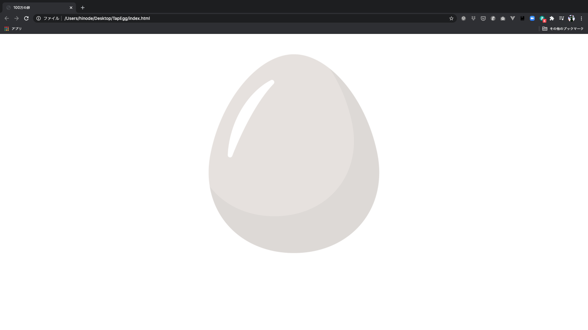

# 100万の卵を作ってみよう２

## レイアウトを整えよう

ひとまず画像をブラウザに表示することができましたが、画像が少し大きくて左に寄ってしまっています。
ですので、画像を中央に表示したいと思います。

各要素の大きさや位置などを変更するために使うのがCSSです。

style.cssファイルを開き、以下のコードを記述して保存してください。

```css
#count {
    font-size: 60px;
    text-align: center;
}
.img-box {
    text-align: center;
}
#egg-img {
    width: 30%;
}
```

index.htmlファイルで指定したid名をCSSで指定するときはid名の前に「#」を、class名をCSSで指定するときはclass名の前に「.」をつけます。

内容としては単純に「countのフォントサイズを60px、文字の水平方向を中央に」、「img-boxの画像の水平方向を中央に」、「egg-imgの横幅を親要素の30％に」という感じです。

<br>
<br>



これで画像（と文字）が良い感じに中央に表示されました。

>画像の位置や大きさが変わらない場合は、index.htmlできちんとstyle.cssを読み込めているか、誤字脱字がないか、ファイル名が合っているかなどを確認してください。

一旦CSSはこのくらいにして、次から早速JavaScriptで動きをつけていきましょう。

